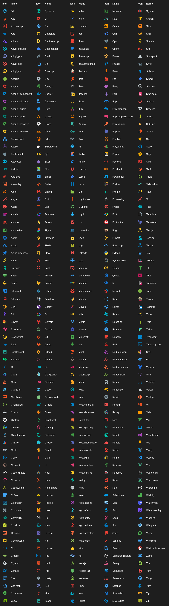
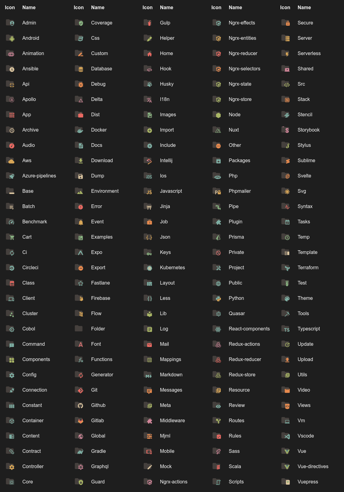

<h1 align="center">
  <br>
    
  <br><br>
  Vs Code+ Icons
  <br>
  <br>
</h1>

<h4 align="center">Get the Vs Code+ Icons into your Zed code editor.</h4>

<p align="center">
    <a href="https://marketplace.visualstudio.com/items?itemName=yusifaliyevpro.vscicons"></a>&nbsp;
    <a href="https://marketplace.visualstudio.com/items?itemName=yusifaliyevpro.vscicons"></a>&nbsp;
    <a href="https://marketplace.visualstudio.com/items?itemName=yusifaliyevpro.vscicons"></a>&nbsp;
    <a href="https://marketplace.visualstudio.com/items?itemName=yusifaliyevpro.vscicons"></a>
</p>


A port of [yusifaliyevpro/vscode-icons](https://github.com/yusifaliyevpro/vscode-icons) to Zed editor. 800+ beautiful file and folder icons.

## Features

- 🎨 **750+ SVG Icons** for files, folders, and programming languages
- 🚀 **Zero Dependencies** — pure SVG icons, no bloat
- 🎯 **Smart Folder Detection** — 591 named folder patterns with open/closed states
- 📦 **Complete Coverage** — file extensions, file names, and folder types
- ✨ **Pixel Perfect** — optimized for Zed's icon rendering

## File icons



### Folder icons



## Installation

### From Zed Extensions

1. Open **Zed** and press `Ctrl+Shift+X` (or `Cmd+Shift+X` on macOS)
2. Search for **"Vs Code+ Icons"**
3. Click **Install**
4. Open settings (`Ctrl+,` or `Cmd+,`)
5. Add:
   ```json
   "icon_theme": "Vs Code+ Icons"
   ```

### Manual Installation (Dev Extension)

```bash
git clone https://github.com/subhangadirli/vs-code-plus-icons-for-zed.git
cd vs-code-plus-icons-for-zed
```

Then in Zed:
1. Press `Ctrl+Shift+X`
2. Paste the full path to `./zed-extension`
3. Click **Install**
4. Set in settings:
   ```json
   "icon_theme": "Vs Code+ Icons"
   ```

## Repository Structure

```
vs-code-plus-icons-for-zed/
├── icons/                    # 750+ SVG icon files
├── zed-extension/            # Zed extension directory
│   ├── extension.toml        # Extension metadata
│   ├── generate_zed_theme.js # Theme generator script
│   ├── icon_themes/          # Generated theme JSON
│   └── icons/                # Symlink to ../icons
├── LICENSE                   # MIT License
└── README.md                 # This file
```

## Icon Coverage

- **File Extensions**: 685+ file types (js, py, rs, go, java, etc.)
- **File Names**: 794+ specific files (Dockerfile, Makefile, package.json, etc.)
- **Folder Names**: 591+ folder patterns (src, dist, node_modules, .git, etc.)
- **Folder States**: Both collapsed and expanded states for all folders

## Contributing

This is a port that automatically syncs icons from the original VS Code extension. 

If you would like to request a new icon or contribute a new icon, **please open an issue or pull request in the upstream repository:**

👉 [yusifaliyevpro/vscode-icons](https://github.com/yusifaliyevpro/vscode-icons)

Once added there, it will be automatically synced to this Zed extension!

## Credits

**Original Icons**: Created by [yusifaliyevpro](https://github.com/yusifaliyevpro)  
**Zed Port**: [Subhan Gadirli](https://github.com/subhangadirli)

## License

MIT License — See [LICENSE](LICENSE) for details.

## Links

- [Original VS Code Extension](https://github.com/yusifaliyevpro/vscode-icons)
- [Zed Editor](https://zed.dev)
- [Zed Extensions Registry](https://github.com/zed-industries/extensions)